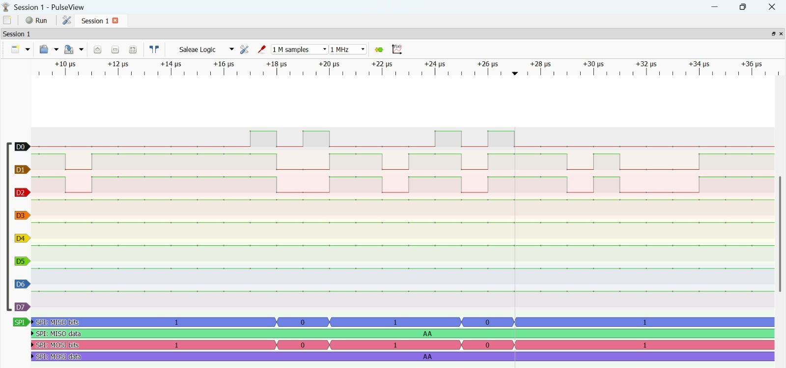

# STM32F446 Register-Level Driver Library

A modular **register-level peripheral driver library** developed from scratch for the **STM32F446RE** microcontroller using Embedded C and CMSIS.

The project focuses on understanding STM32 peripherals at the **register and hardware level**, without using STM32 HAL APIs for peripheral configuration.

The drivers are implemented, debugged, and progressively validated on a **NUCLEO-F446RE development board** using real hardware and a USB logic analyzer where applicable.

---

## Project Overview

The objective of this project is to build a reusable STM32 peripheral driver library while developing a strong understanding of:

- ARM Cortex-M4 architecture
- STM32F4 peripheral architecture
- Memory-mapped peripheral registers
- Embedded C
- GPIO configuration
- Interrupt architecture
- EXTI and NVIC
- UART communication
- Hardware timers
- PWM generation
- ADC conversion
- SPI communication
- I2C communication
- EEPROM interfacing
- Hardware debugging and verification
- Modular driver design

The development workflow followed throughout the project is:

```text
Peripheral Theory
       ↓
Reference Manual Study
       ↓
Register Analysis
       ↓
Driver Implementation
       ↓
Debugging
       ↓
Hardware Verification
       ↓
Application Development
```

## Hardware & Development Environment

| Component | Details |
| :--- | :--- |
| Microcontroller | STM32F446RE |
| Development Board | NUCLEO-F446RE |
| CPU Core | ARM Cortex-M4 |
| Programming Language | Embedded C |
| IDE | STM32CubeIDE |
| Low-Level Framework | CMSIS |
| Debugger/Programmer | ST-LINK |
| Logic Analyzer | 8-channel USB logic analyzer |
| Waveform Software | PulseView |
| Version Control | Git / GitHub |

## Register-Level Approach

The drivers use CMSIS peripheral definitions and direct register manipulation.

Example:

```c
RCC->AHB1ENR |= (1 << 0);
GPIOA->MODER |= (1 << 10);
GPIOA->ODR ^= (1 << 5);
```

The project does not depend on STM32 HAL peripheral APIs for configuring the implemented drivers.

This provides practical experience with:

- Clock enable registers
- GPIO mode registers
- GPIO output/input registers
- Alternate function registers
- Peripheral control/status registers
- Interrupt enable registers
- Timer registers
- ADC registers
- SPI registers
- I2C registers

## Implemented Drivers

| Driver | Implementation | Hardware Verification |
| :--- | :--- | :--- |
| GPIO | Implemented | Verified |
| EXTI / Interrupt | Implemented | Verified |
| UART | Implemented | Verified |
| Timer | Implemented | Verified |
| PWM | Implemented | Verified |
| Servo Control | Implemented | Application tested |
| ADC | Implemented | Verified |
| SPI | Implemented | Verified |
| I2C | Implemented | Verification pending |
| EEPROM | Implemented | Verification pending |

## GPIO Driver

A register-level GPIO driver was developed for configuring and controlling STM32 GPIO peripherals.

**Features:**
- GPIO input configuration
- GPIO output configuration
- Pin mode configuration
- Pull-up / Pull-down configuration
- Pin read / write / toggle
- Alternate Function configuration
- GPIO peripheral clock configuration
- Analog mode configuration

**Hardware Verification:** GPIO output operation was verified using PA5, which is connected to the onboard user LED on the NUCLEO-F446RE.

## EXTI / Interrupt Driver

A register-level external interrupt driver was implemented using the STM32 interrupt architecture.

**Features:**
- SYSCFG configuration
- EXTI configuration
- NVIC configuration
- Rising-edge / Falling-edge / Both-edge trigger
- External button interrupt handling

**Test Configuration:** The onboard B1 user button (PC13) was configured as an external interrupt source. The interrupt handler toggles PA5 whenever the button interrupt occurs.

```text
B1 Button -> PC13 -> SYSCFG -> EXTI -> NVIC -> Interrupt Handler -> PA5
```

## UART Driver

A register-level UART driver was implemented without using STM32 HAL peripheral APIs.

**Features:**
- UART peripheral initialization
- Baud-rate configuration
- Polling-based communication
- Character / String transmission
- Character reception
- UART echo functionality

**Example API:**
```c
void UART_SendChar(UART_Handle_t *huart, char ch);
void UART_SendString(UART_Handle_t *huart, const char *str);
```

**Test Configuration:** USART2 was configured for: Baud Rate: 115200, Data: 8 bits, Parity: None, Stop Bits: 1, Mode: TX/RX. USART2 TX uses PA2.

## Timer Driver

A generalized register-level timer driver was developed using STM32 timers. The driver was tested using TIM2 and TIM3.

**Features:**
- Timer peripheral clock configuration
- Prescaler / Auto-reload configuration
- Counter reset / reading
- Timer start/stop
- Update event / Update interrupt configuration
- NVIC timer interrupt configuration
- Timer-based delay generation

**Timer Periodic Interrupt Project:** A periodic interrupt application was implemented using TIM2. Timer Clock = 84 MHz, Prescaler = 8399, ARR = 9999. This produces a timer update approximately every 1 second.

## PWM Driver

The timer driver was extended to support generalized PWM generation.

**Features:**
- PWM Mode 1
- Duty-cycle control
- ARR / CCR configuration
- Output Compare preload
- Output channel enable
- Output polarity configuration
- PWM channels 1–4

**PWM Configuration Example:**
```c
Timer_Handle_t htim3;
htim3.Instance = TIM3;
htim3.Init.Prescaler = 83;
htim3.Init.Period = 999;
htim3.Channel = TIMER_CHANNEL_1;
htim3.GPIOx = GPIOA;
htim3.Pin = GPIO_PIN_6;
htim3.AFno = 2;
Timer_PWM_Init(&htim3);
Timer_PWM_SetDuty(&htim3, 50);
Timer_PWM_Start(&htim3);
```
This generates: TIM3_CH1 -> PA6 -> AF2, Frequency -> 1 kHz, Duty Cycle -> 50%.

**Servo Motor Control:** Frequency = 50 Hz, Period = 20 ms. 0° -> ~1.0 ms pulse, 90° -> ~1.5 ms pulse, 180° -> ~2.0 ms pulse.

## ADC Driver

A generalized register-level ADC driver was implemented.

**Features:**
- ADC peripheral clock configuration
- ADC initialization / enable/disable
- Channel selection
- Conversion start / EOC status checking
- Data register reading
- Software-triggered conversion

**Hardware Verification:** ADC1 channel 0 on PA0 was tested. PA0 -> 3.3V -> ~4093, PA0 -> GND -> ~1.

## SPI Driver

A register-level SPI driver was implemented.

**Features:**
- SPI peripheral initialization
- Master mode
- Clock polarity / phase configuration
- Baud-rate prescaler configuration
- Software NSS
- MSB/LSB first configuration
- SPI transmission / status flag handling

**Test Configuration:**
```c
Mode: Master
CPOL: 0
CPHA: 0
SPI Mode: Mode 0
Bit Order: MSB First
NSS: Software

uint8_t buffer[] = {0x55, 0xAA, 0xA5};
```

**Loopback Test:** For physical verification, MOSI and MISO were connected together.

```text
SPI1
PA5 / SCK -> Logic Analyzer CH0
PA7 / MOSI -> Logic Analyzer CH1 -+
PA6 / MISO -> Logic Analyzer CH2 -+-> Loopback (MOSI-MISO shorted)
```

The transmitted data was decoded in PulseView using the SPI protocol decoder. Sample rate 8 MHz recommended (min 4x SPI CLK).

**Evidence:**


## I2C Driver

A register-level I2C driver has been implemented.

**Features:**
- I2C peripheral initialization
- GPIO alternate function configuration
- Open-drain configuration
- START / STOP condition generation
- Address / Data transmission
- Status flag handling

The driver uses: PB6 -> I2C1_SCL, PB7 -> I2C1_SDA, AF4, Open-Drain.

Current Status: Implemented, hardware verification pending because an external I2C slave device is required.

## EEPROM Driver

A register-level EEPROM driver has also been implemented on top of the I2C driver for memory address handling, data write/read operations.

Hardware verification will be performed after an appropriate I2C EEPROM device is available.

## Hardware Verification

| Peripheral | Verification Method | Status |
| :--- | :--- | :--- |
| GPIO | Logic analyzer / PA5 waveform | Verified |
| EXTI | Button + PA5 waveform | Verified |
| UART | PC serial terminal | Verified |
| Timer | Logic analyzer / PA5 | Verified |
| PWM | Logic analyzer | Verified |
| ADC | UART terminal measurements | Verified |
| SPI | Logic analyzer + SPI decoder | Verified |
| I2C | External slave required | Pending |
| EEPROM | External I2C EEPROM required | Pending |

Verification evidence is stored inside the docs/ directory:

```text
docs/
├── gpio/
│ └── pa5_waveform.jpeg
├── exti/
│ └── exti_button_test.mp4
├── adc/
│ └── adc_waveform.jpeg
├── uart/
│ └── uart_putty_115200.jpeg
├── timer/
│ └── tim2_1s_interrupt_waveform.jpeg
├── pwm/
│ └── pwm_verification_reference.jpeg
└── spi/
    └── spi_loopback_waveform.jpeg
```

## Project Structure

```text
stm32-driver-library/
├── Core/
│ ├── Inc/
│ │ ├── gpio_driver.h
│ │ ├── uart_driver.h
│ │ ├── timer_driver.h
│ │ ├── adc_driver.h
│ │ ├── spi_driver.h
│ │ ├── i2c_driver.h
│ │ └── eeprom_driver.h
│ └── Src/
│ ├── gpio_driver.c
│ ├── uart_driver.c
│ ├── timer_driver.c
│ ├── adc_driver.c
│ ├── spi_driver.c
│ ├── i2c_driver.c
│ ├── eeprom_driver.c
│ ├── main.c
│ └── stm32f4xx_it.c
├── docs/
│ ├── gpio/
│ ├── exti/
│ ├── adc/
│ ├── uart/
│ ├── timer/
│ ├── pwm/
│ └── spi/
└── README.md
```

## Development Philosophy

1. **Register-Level Understanding:** Peripheral configuration is performed through direct register manipulation using CMSIS definitions.
2. **Modular Drivers:** Each peripheral is implemented as a reusable driver.
3. **Generalization:** Drivers are designed to support multiple pins, channels, peripherals, and configurations.
4. **Hardware Validation:** Drivers are tested on the actual STM32F446RE hardware wherever applicable.
5. **Incremental Development:** Each peripheral is studied from the reference manual and datasheet before implementation.

## Current Progress

- GPIO Driver
- EXTI Driver
- UART Driver
- Timer Driver
- PWM Driver
- Servo Control
- ADC Driver
- SPI Driver - Loopback Hardware Verification
- I2C Driver
- EEPROM Driver
- [ ] I2C Hardware Verification
- [ ] EEPROM Hardware Verification
- [ ] CAN Driver
- [ ] Watchdog Driver
- [ ] RTC Driver[x]

## Future Work

- SPI sensor interfacing, I2C sensor integration
- I2C / EEPROM ACK polling, read/write testing
- CAN driver, Advanced Embedded C (function pointers, callbacks, macros, Makefiles)
- Sensor data acquisition, Data logging, Embedded control applications

## Key Technical Skills Demonstrated

Embedded C, ARM Cortex-M4, STM32F4, CMSIS, Memory-mapped registers, GPIO, EXTI, NVIC, UART, Timers, PWM, ADC, SPI, I2C, EEPROM, Interrupt-driven peripherals, Alternate Function configuration, Hardware debugging, Logic analyzer based verification, PulseView protocol decoding, Git and GitHub

## Author

**Sai Gagan E** - B.Tech Electrical Engineering, Maulana Azad National Institute of Technology (MANIT), Bhopal

## Repository

This repository contains the complete source code and hardware verification evidence for the project. The project is continuously being expanded as additional STM32 peripherals and embedded applications are implemented and verified.
